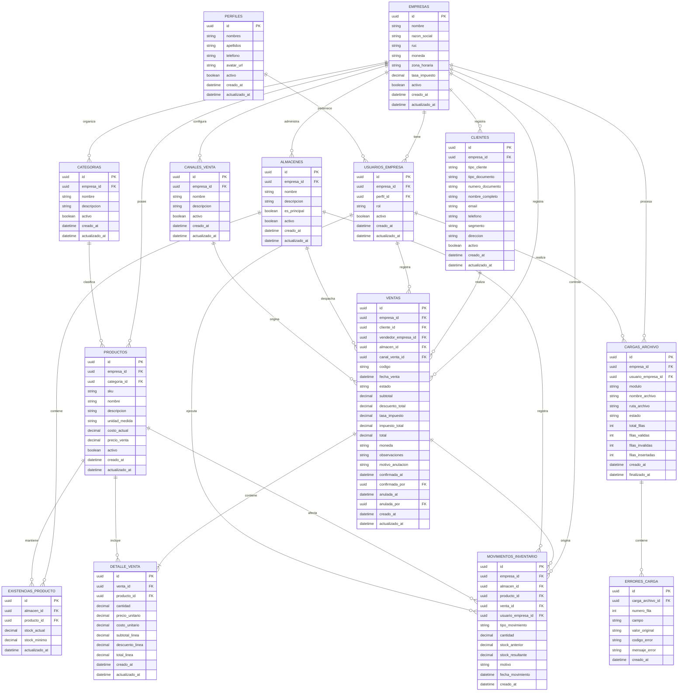

# Diagrama entidad-relación de ComercioBI

El siguiente diagrama representa el modelo transaccional inicial del MVP.

## Relaciones principales

### Empresas y usuarios

Una empresa puede tener muchos usuarios y un usuario puede participar en varias empresas.

La relación muchos a muchos se resuelve mediante la tabla `usuarios_empresa`.

### Categorías y productos

Una categoría puede contener muchos productos.

Cada producto pertenece a una categoría.

### Productos y almacenes

Un producto puede existir en varios almacenes y un almacén puede almacenar varios productos.

La relación muchos a muchos se resuelve mediante `existencias_producto`.

### Ventas y detalle

Una venta debe contener uno o varios registros de detalle.

Cada detalle pertenece a una sola venta y corresponde a un producto.

### Ventas e inventario

Cuando una venta se confirma, puede generar varios movimientos de salida de inventario.

Cuando una venta se anula, genera movimientos de reversa.

### Cargas y errores

Una carga de archivo puede finalizar sin errores o puede contener uno o varios errores asociados a diferentes filas.

## Significado de las relaciones Mermaid

| Símbolo | Significado |
|---|---|
| `||` | Exactamente uno |
| `o|` | Cero o uno |
| `|{` | Uno o varios |
| `o{` | Cero o varios |

Ejemplo:

`VENTAS ||--|{ DETALLE_VENTA`

Significa que una venta contiene uno o varios detalles y que cada detalle pertenece a una sola venta.