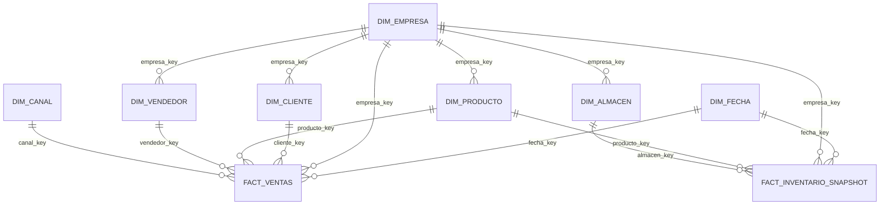

# Modelo estrella - ComercioBI

```mermaid
erDiagram
    DIM_FECHA ||--o{ FACT_VENTAS : fecha_key
    DIM_EMPRESA ||--o{ FACT_VENTAS : empresa_key
    DIM_CLIENTE ||--o{ FACT_VENTAS : cliente_key
    DIM_PRODUCTO ||--o{ FACT_VENTAS : producto_key
    DIM_VENDEDOR ||--o{ FACT_VENTAS : vendedor_key
    DIM_CANAL ||--o{ FACT_VENTAS : canal_key

    DIM_FECHA ||--o{ FACT_INVENTARIO_SNAPSHOT : fecha_key
    DIM_EMPRESA ||--o{ FACT_INVENTARIO_SNAPSHOT : empresa_key
    DIM_PRODUCTO ||--o{ FACT_INVENTARIO_SNAPSHOT : producto_key
    DIM_ALMACEN ||--o{ FACT_INVENTARIO_SNAPSHOT : almacen_key

    DIM_EMPRESA ||--o{ DIM_CLIENTE : empresa_key
    DIM_EMPRESA ||--o{ DIM_PRODUCTO : empresa_key
    DIM_EMPRESA ||--o{ DIM_VENDEDOR : empresa_key
    DIM_EMPRESA ||--o{ DIM_ALMACEN : empresa_key
```

## Granos

- `FACT_VENTAS`: línea de venta confirmada.
- `FACT_INVENTARIO_SNAPSHOT`: fecha + empresa + producto + almacén.
